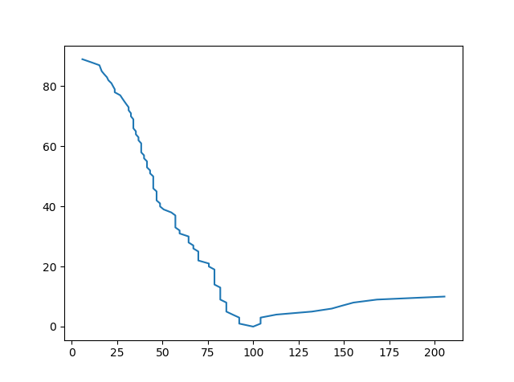
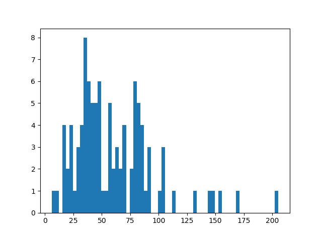
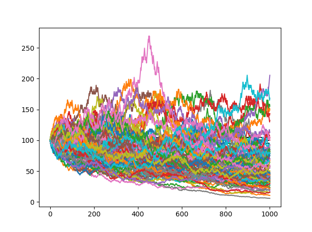

### An evidence of how many from all can get rich by luck from 50% betting (with fee) over time

#### Settings of the report below
- Initial capital = 100
- Simulation instances = 100
- Bet size = 2%
- Betting oods = 0.49 (fees assumed)
- Histogram bins = 64

### Final Balance Cumulative Histogram (from initial cap)

### Final Balance Histogram

### Balance Progression Over Bets

